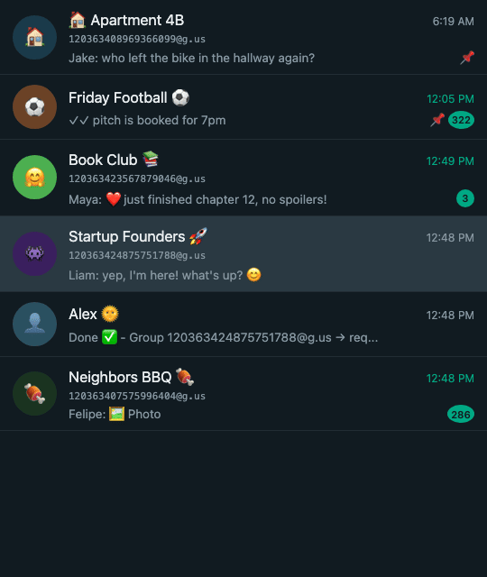

# WhatsApp Group ID Finder

A userscript that displays WhatsApp group IDs directly in the WhatsApp Web sidebar. Click any group ID to copy it to your clipboard.




## Why this exists

[OpenClaw](https://docs.openclaw.ai) connects AI agents to messaging channels like WhatsApp. When configuring which WhatsApp groups your agent should respond in, you need to add group JIDs to the [`groups` allowlist](https://docs.openclaw.ai/channels/whatsapp#whatsapp) in `openclaw.json`:

```json
{
  "channels": {
    "whatsapp": {
      "groups": ["120363001234567890@g.us"]
    }
  }
}
```

The problem: WhatsApp doesn't show group IDs anywhere in its UI. This script makes them visible so you can copy them directly from WhatsApp Web and paste them into your config.

## What it does

- Shows the group JID (e.g. `120363001234567890@g.us`) below each group name in the chat sidebar
- Click the ID to copy it to your clipboard
- Works automatically as you scroll through your chat list

## Installation

1. Install [Tampermonkey](https://www.tampermonkey.net/) (Chrome, Firefox, Edge, Safari)
2. Click the link below to install the script:

   **[Install WhatsApp Group ID Finder](https://raw.githubusercontent.com/danpeg/whatsapp-group-id-finder/main/whatsapp-group-id-finder.user.js)**

3. Open [WhatsApp Web](https://web.whatsapp.com) — group IDs will appear below group names in the sidebar

## How it works

The script uses multiple strategies to find group IDs:

1. **WhatsApp's internal store** — reads group metadata from webpack module cache
2. **IndexedDB** — scans WhatsApp's local database for group records
3. **React fiber traversal** — walks the React component tree to extract group IDs from component props and state

## Use cases

- Building WhatsApp bots or integrations that require group JIDs
- Managing multiple WhatsApp groups programmatically
- Quick reference for group identifiers

## Troubleshooting

**Script not loading?**

Open the browser console (`F12` > Console) and look for `[WA Group ID Finder] Starting v3.0.0`. If you don't see it, make sure the script is enabled in Tampermonkey.

**No group IDs appearing?**

The script may need a few seconds after WhatsApp Web loads. Scroll through your chat list to trigger injection. Check the console for `[WA Group ID Finder]` log messages to see which strategy succeeded.

## License

[MIT](LICENSE)
